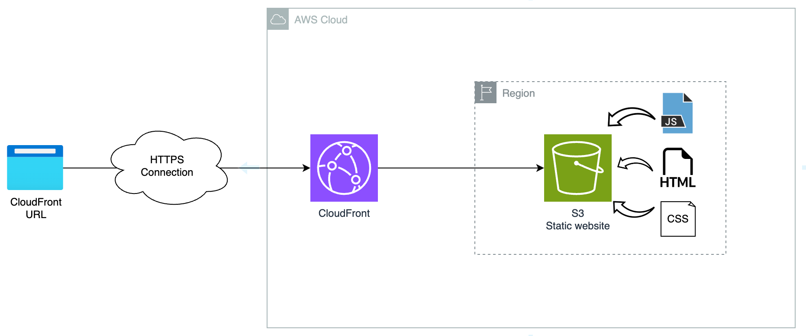
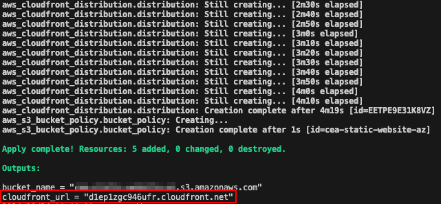
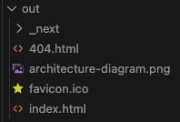
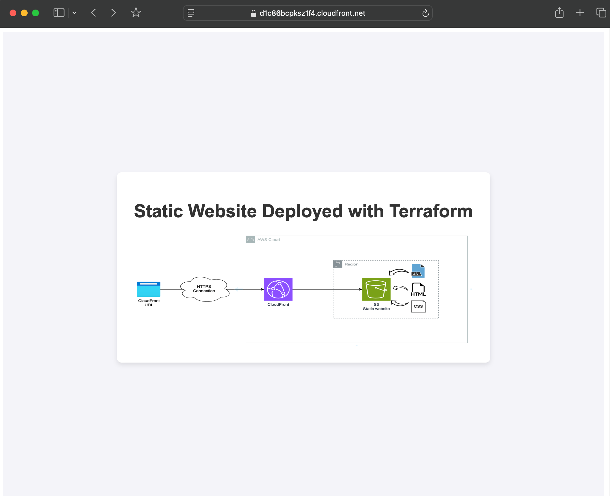

# Static Website Deployment with Terraform

This project is built to help you deploy a **static webpage** using Terraform for Infrastructure as Code (IaC).

## Project Building Requirements

The deployed website must be:

-   Highly available
-   Scalable
-   Cost-effective
-   Fast loading

## Proposed Solution

### Components

We will create a static website using the following AWS resources:

#### CloudFront

This service will allow us to **scale** the user requests, a **fast loading** and will allow the website to be **highly available**.
Also, it will allow us to accept **HTTPS** requests for data encryption in transit.

#### S3 Bucket as Static Website

Will be a **cost-effective** solution to store the HTML, CSS, and JS files. It will **scale** in relation to user requests.

Also, we need to consider that the implementation will be easy.

With both services, the maintenance and management will be minimal, as CloudFront and S3 are serverless, AWS managed services.

### Architecture Diagram



### Key Aspects of The Project

#### State Storage

-   The Terraform state will be stored in S3 and uses DynamoDB for state locking consistency checking.
-   You need to create an S3 bucket and a DynamoDB table with an index named `LockID`.
-   Within the project, copy the file [state.tf.template](terraform/state.tf.template) and name it `state.tf` to provision your information.

### AWS Resources

**S3 Bucket**

-   The bucket is configured to serve the content as a static website.
-   Restricted permissions configured in the [Bucket policy](terraform/assets/bucket_policy.json) to allow access only from the created CloudFront distribution.
-   You can upload any HTML static webpage with their assets (CSS, JS, etc.) to the bucket.
-   The bucket is configured for force destroy in case you later use `terraform destroy`. Otherwise, you will need to remove all files from the bucket before deletion.

**CloudFront Distribution**

-   Creates an Origin Access Control (OAC) to control the access content from S3. Only CloudFront can access to S3 origin.
-   It uses a Default SSL certificated provided by the CDN.
-   Configured a redirection to HTTPS

## Deployment Steps

### Deploy the Infrastructure

1. Initialize terraform.
   Inside the `terraform` folder execute:

```sh
terraform init
```

2. Prepare the variables
   Create the file `terraform.tfvars` and set your bucket name.

```
bucket_name = "<your bucket name>"
```

Keep in mind that bucket names are globally unique.

3. Review the resources to build

```sh
terraform plan
```

4. Deploy the resources

```sh
terraform apply
```

The output should look like this.


Please take note of the CloudFront URL.

If you need that value later, you can request for it with the following command:

```sh
terraform output
```

### The Static Webpage

Once your infrastructure is built, upload the HTML code to your bucket.

#### Example Webpage

For example purposes, a NextJS basic page is configured in folder `nextjs-page`.
You need to execute the following commands in the folder `nextjs-page` with npm installed.

1. Check the webpage locally

```sh
npm run dev
```

The local server will run and you will able to access to `http://localhost:3000`.

2. Compile the app

```sh
npm run build
```

A new folder will be created with name `out`. The folder structure is as follows.


#### Upload the Webpage

In the project's root folder, execute the following command.

```sh
aws s3 cp --recursive nextjs-page/out s3://<your bucket name>
```

The files and folders should be available in your S3 bucket.

## Results

Use the CloudFront URL and access the webpage.
You should be able to view your webpage.


## Final Thoughts

Please remember to remove any AWS resource you will not use.
You can use Terraform:

```sh
terraform destroy
```

## Improvements / To-Do List

-   [ ] Add a pipeline for automated website upload.
-   [ ] Create more variables to more deployment customization.
